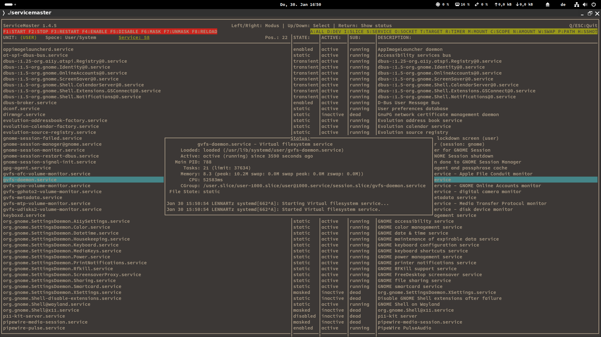
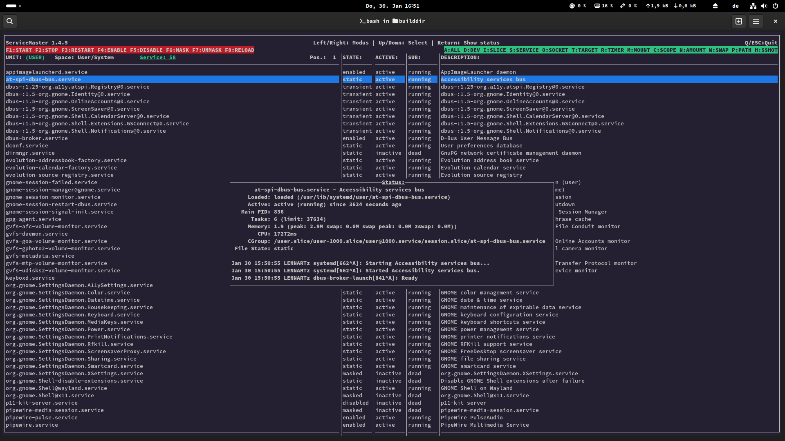

# ServiceMaster 1.5.1

ServiceMaster is a powerful terminal-based tool for managing systemd units on Linux systems. It provides an intuitive interface for viewing and controlling system and user units, making it easier to manage your units without leaving the command line.

## Features

- View all systemd units or filter by type (services, devices, sockets, etc.)
- Start, stop, restart, enable, disable, mask, and unmask units
- View detailed status information for each unit
- Switch between system and user units
- User-friendly ncurses interface with color-coded information
- Keyboard shortcuts for quick navigation and control
- DBus event loop: Reacts immediately to external changes to units

## Requirements

- Linux system with systemd
- NCurses library
- Systemd development libraries

## Usage

After launching ServiceMaster, you can use the following controls:

- Arrow keys, page up/down: Navigate through the list of units
- Space: Toggle between system and user units
- Enter: Show detailed status of the selected unit
- F1-F8: Perform actions (start, stop, restart, etc.) on the selected unit
- A-Z: Quick filter units by type
- Q or ESC: Quit the application

## Security Note

For security reasons, only root can manipulate system units, and only user units can be manipulated when running as a regular user.

## License

This project is licensed under the MIT License. See the [LICENSE](LICENSE) file for details.

## Author

Lennart Martens

## Version

1.5.1

## Building & Install

### Dependencies

#### Archlinux

```bash
pacman -S cmake meson ncurses system-libs
```

#### Ubuntu/Debian

```bash
apt install cmake meson libncurses5-dev libsystemd-dev
```

### Building

```bash
git clone https://github.com/Lennart1978/servicemaster.git

cd servicemaster/

mkdir builddir

meson setup builddir --buildtype=release --prefix=/usr/local

meson compile -C builddir
```

### Install

```bash
meson install -C builddir
```

## For Archlinux users: There is 'servicemaster-git' (recommended) and 'servicemaster-bin' in the AUR

### I recommend installing the -git version ! It is in most cases much more bugfree / stable and uptodate than the -bin version

(I'm not the maintainer of the -bin version)

ServiceMaster in 'Kitty' terminal and 'Monokai' theme:

ServiceMaster in 'Kgx' standard Gnome terminal emulator:


