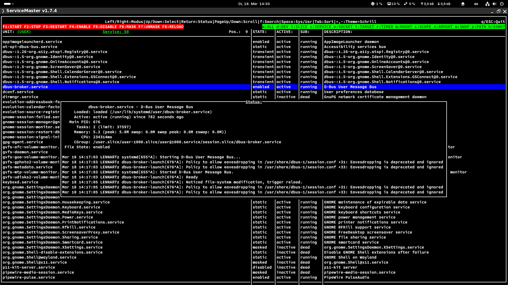
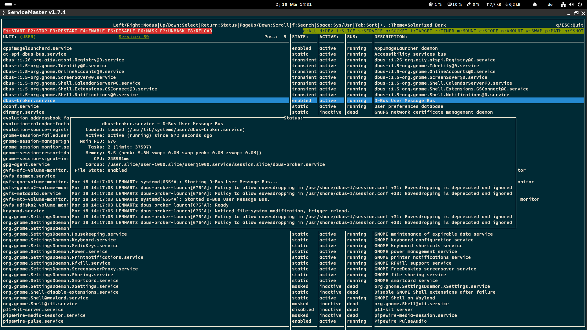
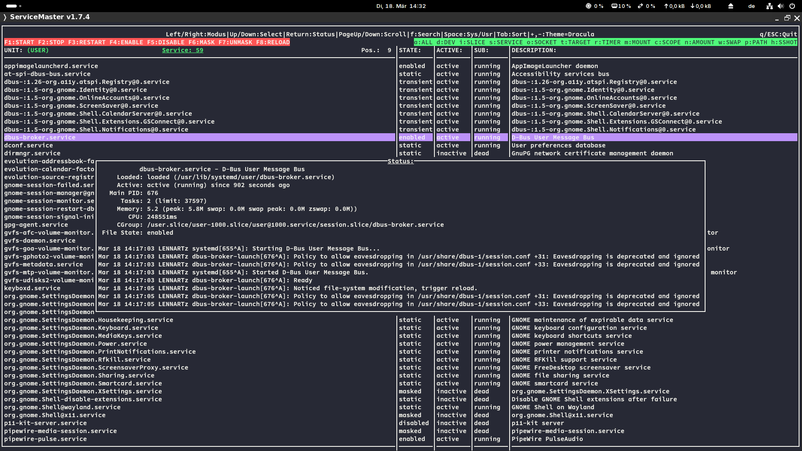
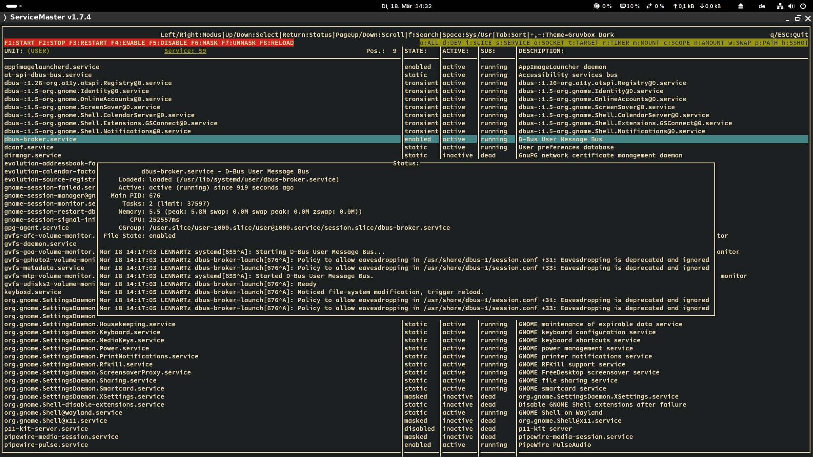
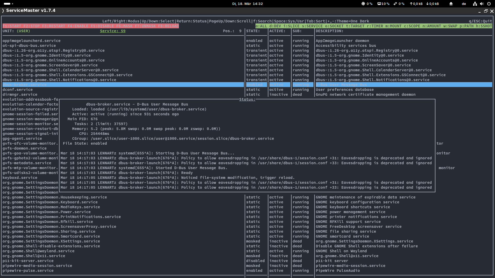
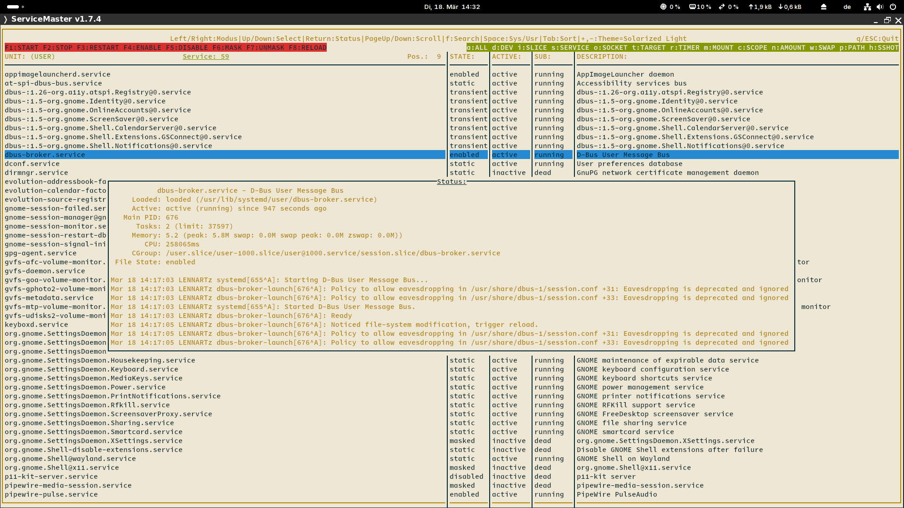

# ServiceMaster 1.7.4

ServiceMaster is a powerful terminal-based tool for managing Systemd units on Linux systems. It provides an intuitive interface for viewing and controlling system and user units, making it easier to manage your units without leaving the command line.

## Features

- View all Systemd units or filter by type (services, devices, sockets, etc.)
- Start, stop, restart, enable, disable, mask, and unmask units
- View detailed status information for each unit
- Switch between system and user units
- User-friendly ncurses interface with color-coded information
- Keyboard shortcuts for quick navigation and control
- DBus event loop: Reacts immediately to external changes to units
- Switch between colorschemes, edit or add colorschemes
- Easy configuration with TOML file
- Search for units by name
- Sort units by different columns (unit name, state, active, sub, description)

## Requirements

- Linux system with Systemd
- ncurses library
- Systemd development libraries

## Usage

After launching ServiceMaster, you can use the following controls:

- Arrow keys, page up/down: Navigate through the list of units
- Space: Toggle between system and user units
- Enter: Show detailed status of the selected unit
- F1-F8: Perform actions (start, stop, restart, etc.) on the selected unit
- a-z: Quick filter units by type
- q or ESC: Quit the application
- +,-: Switch between colorschemes
- f: Search for units by name
- Tab: Select column header, Return: Sort by selected column

## CLI Options

- `-v:` Display the version information and exit
- `-w:` Do not show the welcome message
- `-h:` Display help / usage message and exit
- `-c:` Set the colorscheme.
        Names with a space must be enclosed in quotes!
- `-l:` List all available colorschemes
- `-p:` Print configuration file (with colorschemes)
- `-e:` Edit the configuration file

## Security Note

For security reasons, only root can manipulate system units, and only user units can be manipulated when running as a regular user.

## License

This project is licensed under the MIT License. See the [LICENSE](LICENSE) file for details.

The TOML library is also licensed under the MIT License. See the [toml.h](lib/toml.h) file for details.

## Author

Lennart Martens

## Version

1.7.4 (2025)

## Building & Install

### Dependencies

#### Archlinux

```bash
pacman -S cmake meson ncurses systemd-libs
```

#### Ubuntu/Debian

```bash
apt install cmake meson libncurses5-dev libsystemd-dev
```

### Building

```bash
git clone https://github.com/Lennart1978/servicemaster.git

cd servicemaster/

mkdir builddir

meson setup builddir --buildtype=release --prefix=/usr/local

meson compile -C builddir
```

### If you want to update from a very old version (< 1.6.0), remove the old version first

```bash
 sudo rm /usr/bin/servicemaster && sudo rm /usr/share/man/man1/servicemaster.1
```

### Install

```bash
meson install -C builddir
```

' --prefix=/usr/local' as 'meson setup' option will install to the following locations:

- The man page will be installed to `/usr/local/share/man/man1/servicemaster.1`

- The binary will be installed to `/usr/local/bin/servicemaster`

- The configuration file will be installed to `/etc/servicemaster/servicemaster.toml`

### Uninstall (if you didn't change the prefix)

```bash
sudo rm /usr/local/bin/servicemaster && sudo rm /usr/local/share/man/man1/servicemaster.1 && sudo rm /etc/servicemaster/servicemaster.toml
```

### For Archlinux users: There is 'servicemaster-git' (recommended) and 'servicemaster-bin' in the AUR

### I recommend installing the -git version ! It is in most cases much more bugfree / stable and uptodate than the -bin version

(I'm not the maintainer of the -bin version)

## The configuration

The configuration file is located at `/etc/servicemaster/servicemaster.toml`

You can edit it with:

```bash
servicemaster -e
```

This will open the TOML config file with your standard editor ($EDITOR)

Print the configuration file with:

```bash
servicemaster -p
```

This will just print the config file to stdout, including the size of the file

## Colorschemes

You can add your own colorschemes to the configuration file or change the existing ones.

List all available colorschemes with:

```bash
servicemaster -l
```

Switch between colorschemes using the '+' and '-' keys.

### Screenshots with 10 different colorschemes (Kitty terminal, Nerd Fonts)

Schrill:

Nord:

Solarized Dark:

Dracula:

Monokai:

Gruvbox Dark:

One Dark:

Monochrome:

Solarized Light:

Material:


### Logo


